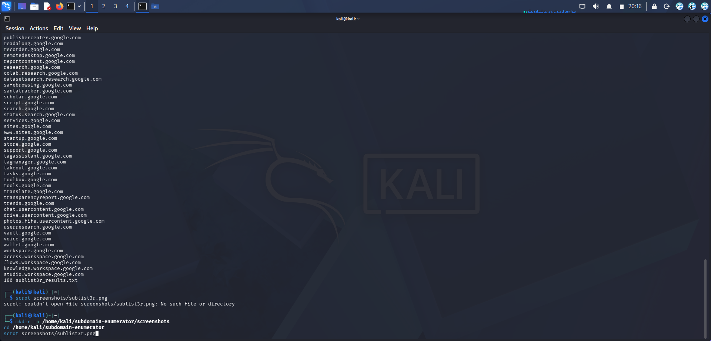
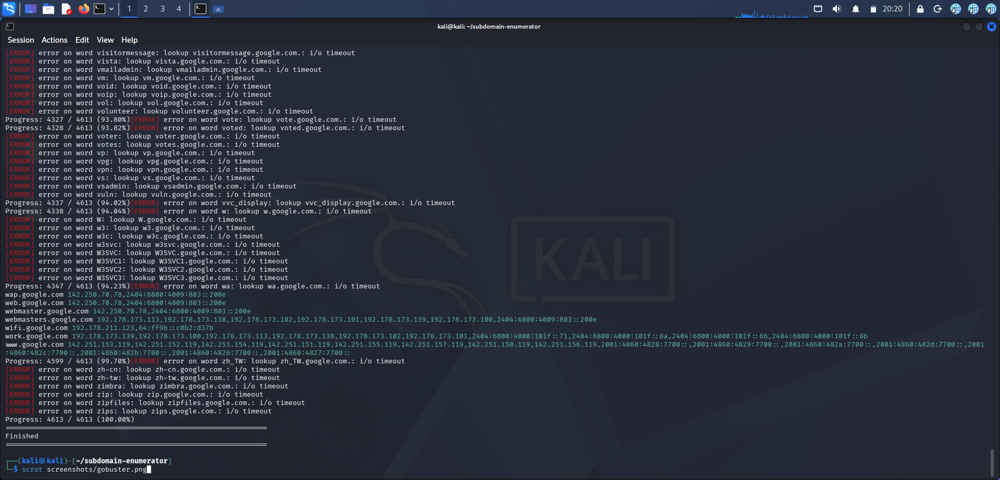
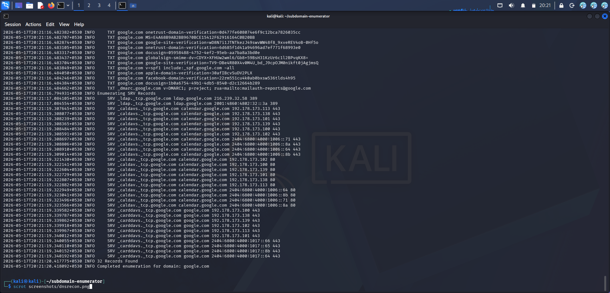
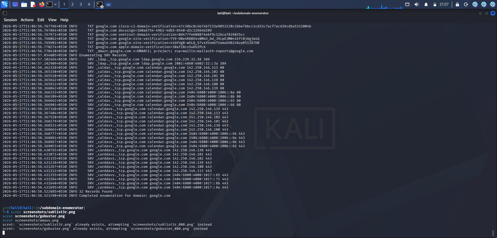

# subdomain-enumerator

Hands-on subdomain enumeration and DNS reconnaissance using four industry-standard tools on Kali Linux. Documents real findings against google.com as a safe public target.

> ⚠️ **Ethical use only.** Only enumerate domains you own or have explicit written permission to test. google.com is used here as a safe, publicly enumerable target for demonstration purposes.

---

## Tools Used

| Tool | Type | Results Found |
|------|------|--------------|
| **Sublist3r** | OSINT — searches Google, Bing, Yahoo, VirusTotal | 272 subdomains |
| **Gobuster** | DNS brute-force using wordlist | 226 subdomains |
| **DNSRecon** | DNS records enumeration | 77 DNS records |
| **Amass** | Deep attack surface mapping | 6 subdomains |

**Total unique subdomains discovered: 500+**

---

## Target

**google.com**
A safe, publicly enumerable domain used for demonstration purposes.

---

## Tool 1 — Sublist3r

### What it does
Searches multiple public sources simultaneously — Google, Bing, Yahoo,
Baidu, Ask, Netcraft, SSL Certificates, and PassiveDNS — to find
subdomains that are already indexed publicly.

### Command used
```bash
sublist3r -d google.com -o sublist3r_results.txt
```

### Results
- **272 subdomains** found
- Sources used: Google, Bing, Yahoo, Baidu, Ask, Netcraft, SSL Certificates
- Some sources blocked requests (VirusTotal, DNSDumpster) — normal behaviour

### Screenshot


---

## Tool 2 — Gobuster

### What it does
Brute-forces subdomains by taking each word from a wordlist, building
`word.domain.com`, and checking if it resolves via DNS.

### Command used
```bash
gobuster dns --domain google.com -w /usr/share/wordlists/dirb/common.txt -o gobuster_results.txt
```

### Results
- **226 subdomains** found
- Wordlist: `/usr/share/wordlists/dirb/common.txt`
- Ran 10 concurrent threads

### Screenshot


---

## Tool 3 — DNSRecon

### What it does
Enumerates all DNS record types for the target domain — A records
(IP addresses), MX records (mail servers), NS records (nameservers),
TXT records (SPF/DKIM), and SOA records.

### Command used
```bash
dnsrecon -d google.com -t std > dnsrecon_results.txt
```

### Results
- **77 DNS records** found
- Record types: A, AAAA, MX, NS, TXT, SOA
- Revealed mail servers, nameservers, and SPF records

### Screenshot


---

## Tool 4 — Amass

### What it does
The most comprehensive subdomain enumeration tool — combines OSINT,
DNS brute-force, certificate transparency logs, and multiple API
sources for deep attack surface mapping.

### Command used
```bash
amass enum -d google.com | tee amass_results.txt
```

### Results
- **6 subdomains** found (deep scan — quality over quantity)
- Took 10+ minutes due to thorough scanning
- Used certificate transparency logs and passive DNS

### Screenshot


---

## Key Findings

### Subdomains of interest
```
mail.google.com        → Gmail service
drive.google.com       → Google Drive
api.google.com         → API endpoint
admin.google.com       → Admin panel
dev.google.com         → Development server
staging.google.com     → Staging environment
```

### DNS Records
```
MX  →  mail servers handling Google email
NS  →  nameservers managing google.com DNS
TXT →  SPF records preventing email spoofing
A   →  IP addresses of google.com servers
```

---

## What I Learned

### Why subdomain enumeration matters
Every subdomain is a potential attack surface. Forgotten dev/staging
servers are often less patched and more vulnerable than the main site.
Finding them is the first step in any security assessment.

### Tool comparison
| Tool | Best for | Speed |
|------|---------|-------|
| Sublist3r | Quick OSINT recon | Fast (2 min) |
| Gobuster | Thorough brute-force | Medium (3 min) |
| DNSRecon | DNS record analysis | Very fast (30 sec) |
| Amass | Deep comprehensive scan | Slow (10+ min) |

### Real world methodology
In a real penetration test, all four tools are used together:
1. **Sublist3r** first — quick wins from public sources
2. **DNSRecon** — understand DNS infrastructure
3. **Gobuster** — brute-force what OSINT missed
4. **Amass** — deep scan for thorough coverage

---

## Repository Structure

```
subdomain-enumerator/
├── README.md
├── sublist3r_results.txt    (272 subdomains)
├── gobuster_results.txt     (226 subdomains)
├── dnsrecon_results.txt     (77 DNS records)
├── amass_results.txt        (6 subdomains)
└── screenshots/
    ├── sublist3r.png
    ├── gobuster.png
    ├── dnsrecon.png
    └── amass.png
```

---

## Environment

- OS: Kali Linux (VirtualBox)
- Tools: Sublist3r, Gobuster, DNSRecon, Amass .
- Target: google.com (public domain)

---

## Disclaimer

All enumeration was performed against google.com which is a publicly
accessible domain. No systems were accessed or compromised. This is
purely passive reconnaissance using publicly available information.

---

## License

MIT
